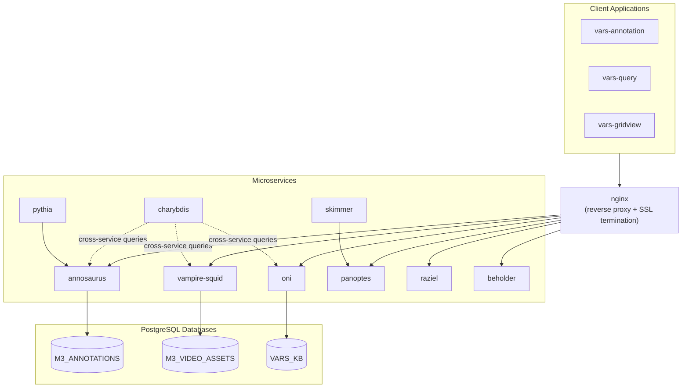

# Architecture

VARS is a microservices system organized into four layers: orchestration, web, application, and data.

## System Diagram

## Layers

### Orchestration

The `varsq` Bash script is the command-line interface for managing the deployment. It handles environment configuration, SSL certificate generation, service start/stop, database backups, and pass-through to Docker Compose.

### Web

An nginx reverse proxy sits in front of all services. It handles SSL termination and routes incoming requests by path prefix:

| Path | Service |
|------|---------|
| `/anno/` | annosaurus |
| `/vam/` | vampire-squid |
| `/kb/` | oni |
| `/panoptes/` | panoptes |
| `/config/` | raziel |
| `/capture/` | beholder |

### Application

Nine microservices handle distinct responsibilities. Core services (annosaurus, vampire-squid, oni) own the primary data stores. Support services (raziel, charybdis) provide gateway and cross-service query capabilities. Processing services (beholder, skimmer, pythia) handle media and ML workflows.

See [Services](services.md) for details on each.

### Data

Three PostgreSQL databases run within a single container:

| Database | Owner service | Contents |
|----------|--------------|----------|
| `M3_ANNOTATIONS` | annosaurus | Observations, image moments, associations |
| `M3_VIDEO_ASSETS` | vampire-squid | Video sequences, metadata, references |
| `VARS_KB` | oni | Taxonomy and concept hierarchies |
